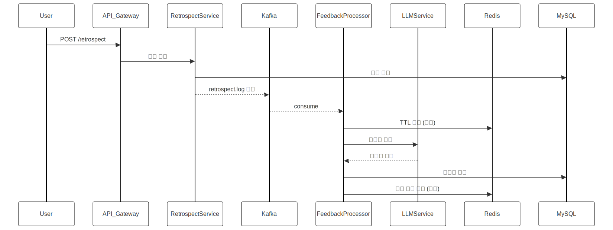

# DignifyLab 회고 기반 자기 피드백 플랫폼 (백엔드 설계 문서)

## ✨ 서비스 개요
사용자의 회고 데이터를 수집하고, Kafka 기반의 비동기 파이프라인을 통해 Redis에 저장 및 처리한 뒤, LLM을 활용한 자기 피드백 및 행동 교정 조언을 제공하는 백엔드 중심 마이크로서비스 기반 플랫폼입니다.

이 서비스는 오픈소스 LLM + Dify, Redis Stream/TTL, Kafka, Kubernetes, Terraform 등 기술 고도화를 위한 실전 구조와, 의미 있는 사용자 가치를 동시에 추구합니다.

---

## 🚀 아키텍처 설계

```text
[User]
   |
   | HTTP API (회고 작성 / 피드백 요청)
   V
[API Gateway]
   |
   | (Kafka Pub)
   V
[Retrospect Service] --- (DB)
   |
   | Kafka Topic (retrospect.log)
   V
[Feedback Processor] --- (Redis, LLM)
   |
   | HTTP API (피드백 요청 수신)
   V
[LLM Service (Dify / OSS)]
   |
   | Async Response 저장
   V
[Feedback DB / Redis TTL 캐시]

+ Redis Stream을 활용한 피드백 큐
+ Kafka 메시지를 기반으로 분석 비동기 처리
+ 로컬 Docker-Compose 및 K8s 테스트 환경 고려
```

---

## 📈 주요 서비스 구성

| 서비스 | 설명 |
|--------|------|
| **API Gateway** | 사용자 요청 라우팅 (Spring Cloud Gateway or Nginx API Gateway) |
| **Retrospect Service** | 회고 등록 및 DB 저장, Kafka에 이벤트 발행 |
| **Feedback Processor** | Kafka Consumer, Redis/LLM 기반 피드백 생성 |
| **LLM 서비스** | 오픈소스 LLM (Dify, LM Studio 등) 연결, 피드백 생성 |
| **Storage Layer** | MySQL (Retrospect, Feedback), Redis (TTL 캐시, Stream) |
| **Infra** | Docker Compose (dev), Terraform + K8s (infra IaC) |

---

## 🖊️ ERD 설계

```text
[users]
- id (PK)
- email
- created_at

[retrospects]
- id (PK)
- user_id (FK)
- purpose (TEXT)   -- 회고 목적
- content (TEXT)   -- 회고 내용
- created_at

[feedbacks]
- id (PK)
- retrospect_id (FK)
- summary (TEXT)        -- 회고 요약
- strength (TEXT)       -- 잘한 점
- weakness (TEXT)       -- 부족한 점
- keep_doing (TEXT)     -- 계속해야 할 점
- recommendation (TEXT) -- 행동 교정 제안
- created_at
```

---

## ⏱️ 시퀀스 다이어그램 (회고 작성 → 피드백 생성)



---

## ✅ 개발 순서 제안
1. MySQL 기반 Retrospect/Feedback 도메인 구현
2. API Gateway + Retrospect Service 개발 (POST /retrospect)
3. Kafka 연결 및 이벤트 발행 구조 구축
4. Feedback Processor 구축 (Kafka consumer + Redis + LLM 연동)
5. Dify/로컬 LLM 설정 + 연동 테스트
6. Docker Compose 통합 → K8s 배포 스크립트 준비 (Terraform 포함)
7. k6로 트래픽 시뮬레이션 → 성능 테스트

---

## ✨ 향후 확장 가능성

- 사용자별 회고 히스토리/대시보드 API 제공
- LLM 피드백 정밀도 향상을 위한 프롬프트 튜닝
- 주간/월간 회고 기반 성장 리포트 자동 생성
- 프론트엔드 + 관리자 UI 추가 확장 가능 (React 기반)